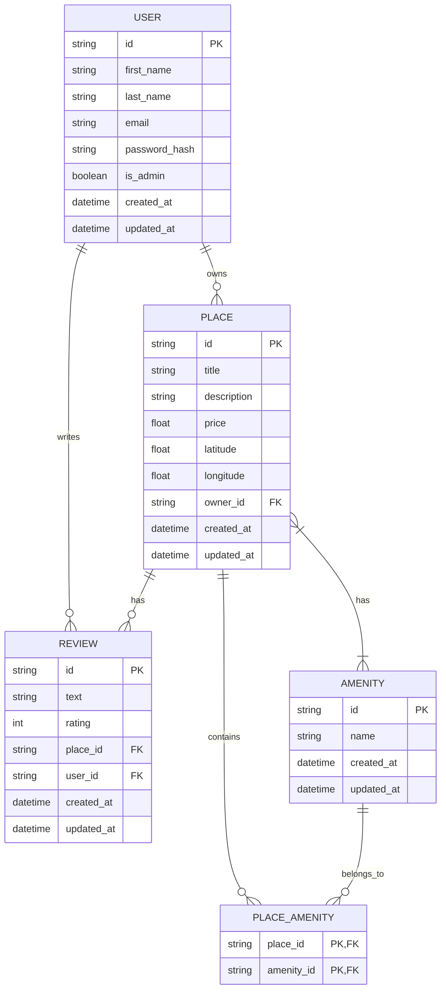

# HBNB Database Schema

## Database Relationships

1. **User to Place**: One-to-Many
   - A User can own multiple Places
   - Each Place is owned by exactly one User

2. **User to Review**: One-to-Many
   - A User can write multiple Reviews
   - Each Review is written by exactly one User

3. **Place to Review**: One-to-Many
   - A Place can have multiple Reviews
   - Each Review belongs to exactly one Place

4. **Place to Amenity**: Many-to-Many
   - A Place can have multiple Amenities
   - An Amenity can be included in multiple Places
   - The PLACE_AMENITY table represents this many-to-many relationship

## Schema Details

### User Table
- Primary identifier with UUID
- Basic personal info (first and last name)
- Email (unique identifier for login)
- Securely hashed password
- Admin flag for authorization
- Timestamps for record tracking

### Place Table
- Details about the rental property
- Geographic coordinates
- Foreign key to the owner (User)
- Timestamps for record tracking

### Review Table
- Review content and rating
- Links to both the Place being reviewed and the User who wrote it
- Timestamps for record tracking

### Amenity Table
- Simple description of available features
- Timestamps for record tracking

### Place_Amenity Table
- Junction table for the many-to-many relationship between Places and Amenities
- Composite primary key of place_id and amenity_id
